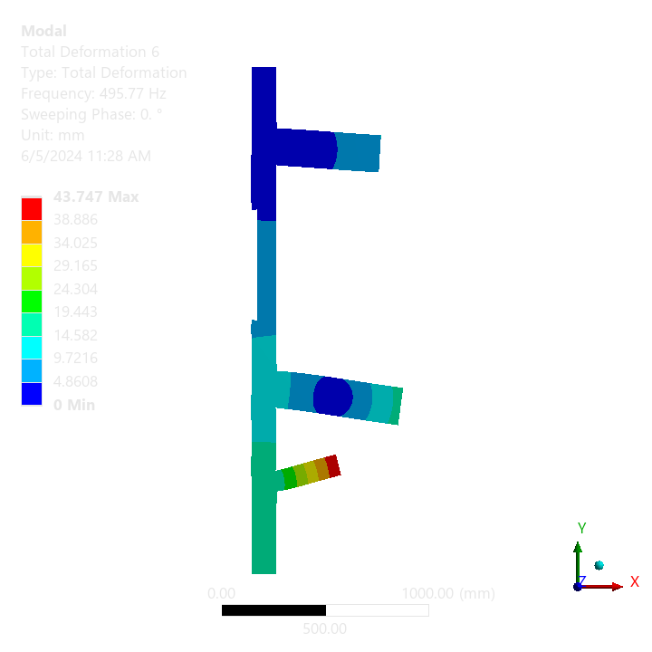

# Workshop 1: Scrape mechdb files

# Problem statement
Develop a Command Line interface (CLI):
Inputs:
- a json file for bearing data to be applied to the AUTO_BEARING object
- a set of rotational velocity in Y points
- solve point number (1-based index)
- a mode number
Outputs:
- filename for the output image

Run a modal analysis based on the template model for 6 modes with the above inputs, computes the total deformation result for the given solve point and mode, and generates:
- a printout of:
    - elapsed solution time in s
    - maximum total deformation in mm
    - minimum total deformation in mm
    - standard deviation of the total deformation
- a png file containing the total deformation viewed from the XY plane

# Workspace
See `cli.py` for the CLI and `lib.py` for the implementation. The template mechdb and example csv file can be found in the `Files` folder. A solved version of
the template is in `template-solved.mechdb`

# Expected result
See the `template-solved.mechdb` for the solved mechdb containing the below inputs.
cli.py --model Files/template.mechdb --input Files/bearing_data.json --velocities=1;1500;2600 --solve-point=2 --mode=3 --output sample.png

Results:
    Elapsed solution time: 3.0s
    Maximum total deformation: 43.74699667096138mm
    Minimum total deformation: 0.0mm
    Standard deviation: 7.672245247399096mm

