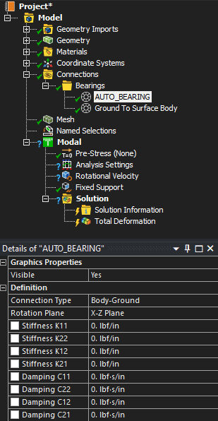

# Workshop 3: Bearing simulation

# TODO - put screenshot of model here. Clear the template model.

# Problem statement
Implement the given Command Line interface (CLI).

Inputs:
- a json file for bearing data to be applied to the AUTO_BEARING object
- a set of rotational velocity in Y points
- solve point number (1-based index)
- a mode number

Outputs:
- filename for the output image

Run a modal analysis based on the template model.



The model analysis should have 6 modes with the above inputs. The script should compute the total deformation result for the given solve point and mode, and generate the following:

- a printout:
    - elapsed solution time in `s`
    - maximum total deformation in `mm`
    - minimum total deformation in `mm`
    - standard deviation of the total deformation in `mm`
- a png file containing the total deformation result viewed from the XY plane

# Workspace
See `cli.py` for the CLI and `lib.py` for the implementation of the command line interface and implementation library. The template mechdb and example csv file can be found in the `Files` folder. The functions that are not yet implemented are in `lib.py`: `_export_image`, `_setup`, and `_get_output`

# Expected result

```
$ python cli.py --model Files/template.mechdb --input Files/bearing_data.json --velocities=1,1500,2600 --solve-point=2 --mode=3 --output sample.png
Results:
    Elapsed solution time: 3.0s
    Maximum total deformation: 43.74699667096138mm
    Minimum total deformation: 0.0mm
    Standard deviation: 7.672245247399096mm
```


# Note
See the `template-solved.mechdb` for a solved version of the mechdb containing the below inputs. It can be opened in standalone Mechanical using the following command line:

`ansys-mechanical -g -p Files/template-solved.mechdb`
