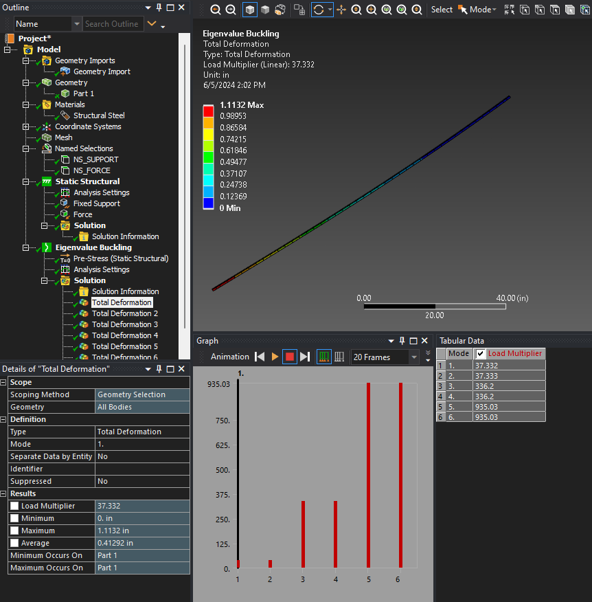

# Workshop 3: Buckling bar

# Problem statement
Run the given buckling analysis script in four ways:

1. Loading/running the script from the Mechanical scripting view (IronPython)
2. Running from command line using the `ansys-mechanical` CLI (IronPython)
3. Using the embedding interface (CPython)
4. Using a remote session (IronPython)



# Workspace
See `script.py` for the buckling analysis script.

# Expected result
Running the script will lead to the following printout:

```
('Mode 1 deformation load multiplier: ', 37.332476719440791)
('Mode 2 deformation load multiplier: ', 37.332520198294276)
('Mode 3 deformation load multiplier: ', 336.19713108482711)
('Mode 4 deformation load multiplier: ', 336.19814949649407)
('Mode 5 deformation load multiplier: ', 935.025985364769)
('Mode 6 deformation load multiplier: ', 935.02952009699732)
('Mode 6 equivalent stress maximum: ', '31313.44421227253 [psi]')
```
